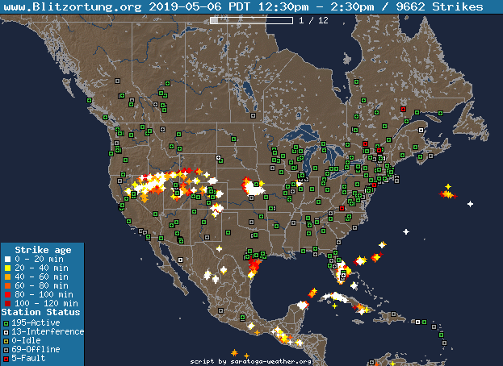

# Blitzortung Lightning Map generator

**NOTE: You must be operating a Blitzortung Lightning Detector and be submitting data**
**to blitzortung.org to be able to run these scripts.  The scripts require a valid**
**blitzortung.org userid and password to retrieve the data needed for the map generation.**

## About Blitzortung

The [Blitzortung](http://en.blitzortung.org/cover_your_area.php) network members build (from kit parts) the lightning detector which monitors H-field (and now can do E-field) emissions from lightning strikes, and sends strike data to a set of servers in Europe to correlate the Time-Of-Arrival at detectors v.s. GPS-time and uses that to geo-locate strikes. There is a great (and somewhat hypnotic) [realtime map](http://en.blitzortung.org/live_lightning_maps.php?map=30) for North America where you can see real-time strike info, and which stations participated in the location of that strike. There is a companion site that offers the same data and uses a [zoomable Leaflet Map](http://www.lightningmaps.org/#m=oss;t=3;s=0;o=0;b=0.00;ts=0;y=38.3417;x=-91.8896;z=4;d=2;dl=2;dc=0;) for display.

For those interested in more information about Blitzortung, there is a Blitzortung forum in the US at [WXForum.net](https://www.wxforum.net/index.php?board=115.0) and a [public forum](http://en.blitzortung.org/forum.php) .. to access the internal forum, there, you'll need to have a Blitzortung member id.

## Script Purpose

This script set will read lightning strike and reporting station data from the password-protected data store at blitzortung.org.  The script will create one or more animated GIF map images (and corresponding mapdef HTML for popup station data display) at each run.  The script set is intended to be run as a cron job every 10 minutes and so the maps show a 2-hour animated display (12 images).

## Sample map



## Installation:

  - Unzip the contents to a directory (default is ##BOmaps/##) on your offline copy of your website.

  - Customize _gen-BO-maps.php_ with your settings.

  - Customize the _animate.txt_ Bash script to run gen-BO-maps.php on your webserver.
  (don't forget to ```chmod +x animate.txt``` to make it executable, and use Linux line-endings (\n or LF)
    and NOT Windows line endings (\r\n or CR LF)

  - Add bash execution of _animate.txt_ at 5 minute intervals to your crontab.  I use something like
```
  */5 * * * * /bin/bash /path/to/my/BOmaps/animate.txt
```  
Note:  the first run of the cron job can take a while to load the strikes.txt file from Blitzortung.
Each 10 minute period seems to take about 10 seconds to execute.  If you have shell access to your
website, it would be a good idea to manually run the get-BO-maps.php the first time (before activating the cron job).  Just sayin'

  Once the cron is running, wait for 1 hour before putting your pages live (to let the sequence of 10 images fill from the 5 minute data collection.

## Contents:

  - BOmaps/gen-BO-maps.php     - main configuration and execute-via-cron script (customize)
  - BOmaps/BO-station-inc.php  - generate detail page for a Blitzortung station number (customize)
  - BOmaps/animate.txt         - cron bash script to run gen-BO-maps.php (customize)
  - BOmaps/php.ini             - enables allow_url_fopen (required for script operation)
  - BOmaps/BO-mapgen.php       - included() by gen-BO-maps.php -- generates the maps (no customize needed)
  - BOmaps/GIFencoder.class.php- used by BO-mapgen.php to make the -ani.gif animated GIF file(s)
  (no customize needed)
  - BOmaps/BO-station.php      - display detail page for a Blitzortung station (customize)
  - BOmaps/BONorthAmerica.php  - display sample North America clickable animated GIF map (customize)
  - BOmaps/BOSWN.php           - display sample Southwest clickable animated GIF map (sample)
  - BOmaps/BOUSA.php           - display sample USA clickable animated GIF map (sample)
  - BOmaps/index.php           - display sample North America clickable animated GIF map (customize)
  - BOmaps/lightningicons.png  - GRLevel3 placefile icon file
  - BOmaps/NorthAmerica.png    - sample base map graphic
  - BOmaps/EasternCanada.png   - sample base map graphic
  - BOmaps/Ontario.png         - sample base map graphic
  - BOmaps/SouthernOntario.png - sample base map graphic
  - BOmaps/SWN.png             - sample base map graphic
  - BOmaps/USA.png             - sample base map graphic
  - BOmaps/WesternCanada.png   - sample base map graphic

  - BOmaps/cache/gen-BO-maps-log.txt   - starter file -- replaced with log of last run
  - BOmaps/cache/strikes.txt   - starter file -- replaced with last 2 hrs of strike data by cron
  - BOmaps/cache/stations.txt  - starter file -- replaced by - stations.json at each cron execution
  - BOmaps/cache/index.php     - just to prevent reading cache/ directory listing

## Customization:

### gen-BO-maps.php customization:

Adjust the following entries to your specific installation:

```php
#--------------------------------------------------------------------------------
# settings to adjust
#
# error_reporting(E_ALL);
$region= "3";             # Blitzortung REGION number
$username= "username";  # YOUR Blitzortung USERID for the blitzortung.org website
$password= "your-password";  # YOUR Plitzortung PASSWORD for the blitzortung.org website
$ourTZ = "America/New_York";

$BOcacheDir = "cache/";   # relative FILE path to CACHE directory with trailing '/'
$URLpath = '/BOmap/';     # absolute URL path on website to main directory with leading/trailing '/'.

# for the GRLevel3 placefile, specify the full URL of the icons file for GRLevel3 use
$GR3icons = 'http://your-website/BOmaps/lightningicons.png';

$doLog = true;     # =true, generate the log (recommended), =false suppress log
$doPrint = false;  # =true, also print log to output (not required, but helpful for debug)
$doMapArea = true; # =true, gen <map><area> files for clickable detailed stats.

$numimages = 12; // number of images in animated GIFs

$MapList = array(
  # generate multiple maps from one 'pull' of strikes from blitzortung.org
  # NOTE: make sure base-map and generated-map-name ARE NOT THE SAME
  #   Only generate a placefile once for NorthAmerica -- it's all that GRLevel3 handles
  # base-map|generated-map-name|north,west,south,east|legend-loc|GR3placefile|thumbnail-width|
   'NorthAmerica.png|BONorthAmerica.png|62.0,-145.0,10.0,-50.0|bottom,left|placefile.txt|320|',

  #'USA.png|BOUSA.png|52.0,-127.0,16.0,-65.0|bottom,right|placefile.txt|120|',
  #'SWN.png|BOSWN.png|43.0,-125.0,30.0,-108.0|bottom,left||120|',
  #'Ontario.png|BOOntario.png|58.0,-98.0,40.0,-72.0|top,right||',
  #'SouthernOntario.png|BOSouthernOntario.png|50.0,-98.0,40.0,-72.0|top,right||',
  #'EasternCanada.png|BOEasternCanada.png|62.0,-100.0,35.0,-50.0|top,right||',
  #'WesternCanada.png|BOWesternCanada.png|62.0,-150.0,35.0,-90.0|bottom,left||',
);

$Overlays = array( # for overlays-by-base-map
  #
  # OPTIONAL: plot names/text of city/Airport/text over a map by lat,long with a 7px marker
  #
  # base-map|text-to-plot|lat,long|offset-X,offset-Y|
  #  note: offset-X,offset-Y are optional. defaults to |5,-10| pixels
  #  offset-X positive=Right, negative=Left; offset-Y positive=Down, negative=Up
  #
  #'NorthAmerica.png|Atlanta|33.75,-84.38||',
  #'NorthAmerica.png|New Orleans|29.85,-90.08|-5,3|',
  'SWN.png|Sacramento|38.555556,-121.468889|5,3|',
  'SWN.png|Carson City|39.160833,-119.753889|7,-5|',
  'SWN.png|Phoenix|33.45,-112.066667||',
  'SWN.png|Salt Lake City|40.75,-111.883333||',
);

# end of required settings
#--------------------------------------------------------------------------------
```

  As initially set, only one map (BONorthAmerica) will be generated.. enable others as desired.

### Configure the BO-station-inc.php

```php
#--------------------configure to match gen-BO-maps.php settings ----------------
$BOcacheDir = "cache/";
$local_stations_file = $BOcacheDir.'stations.txt';
$numimages = 12; # should match $numimages in gen-BO-maps.php
$ourTZ = 'America/New_York';
$timeFormat = "d-M H:i:s T";
#-------------------- end configuration ------------------------------------------
```

### Configure the animate.txt

```
# --- begin settings
# set HDIR to full (absolute) FILE path to BOmaps directory on your website
HDIR=/kunden/homepages/9/d141952417/htdocs/wx/BOmaps

# set PHPcmd to full (absolute) FILE path to PHP V5+ on your host
PHPcmd=/usr/bin/php

# --- end settings
```

NOTE: Linux hates Windows line terminations (CR LF) .. make sure that your animate.txt file
has only LF line endings or the cron execution of the script will fail.


Make sure that the ./cache/ directory is writable for new files. Permissions 775

You may have to change permissions to 666 on:

  - BOmap/cache/gen-BO-maps-log.txt
  - BOmap/cache/strikes.txt
  - BOmap/cache/stations.txt

The cache/ directory will have a series of files created for each map you generate:

  - BOmap/cache/NorthAmerica_n.png  (n=1..$numimages)
  - BOmap/cache/NorthAmerica_n.gif  (n=1..$numimages)
  - BOmap/cache/NorthAmerica-map.html
  - BOmap/cache/NorthAmerica-ani.gif

If a thumbnail is also selected, then you'll have the following files generated

  - BOmap/cache/NorthAmerica-sm_n.png  (n=1..$numimages)
  - BOmap/cache/NorthAmerica-sm_n.gif  (n=1..$numimages)
  - BOmap/cache/NorthAmerica-sm-ani.gif   (because a 320px wide thumnail was selected)

You'll get a rotating series of the stations.json files:

  - BOmap/cache/stations_n.txt  (n=1..$numimages)

and the log file for the last execution of the script

  - BOmap/cache/gen-BO-maps-log.txt

# Appendix:

NorthAmerica.png map produced using:
```
http://en.blitzortung.org/map_generator.php?update=1&map_generator_north=62&map_generator_west=-145&map_generator_east=-50&map_generator_south=10&map_generator_projection=M&map_generator_resolution=f&map_generator_scaling=93&map_generator_min_area=50&map_generator_shorelines=0.01p%2F128%2F128%2F128&map_generator_boundaries=a%2F0.01p%2F128%2F128%2F128&map_generator_rivers=1%2F0.1p%2F39%2F62%2F88&map_generator_dry_area=&map_generator_wet_area=24%2F39%2F61&map_generator_lakes=39%2F62%2F88&map_generator_color_map=-10000+101++85++69++10000+101++85++69&map_generator_azimuth=315&map_generator_normalization=0.2
```
EasternCanada.png map produced using:
```
http://en.blitzortung.org/map_generator.php?update=1&map_generator_north=62&map_generator_west=-100&map_generator_east=-50&map_generator_south=35&map_generator_projection=M&map_generator_resolution=f&map_generator_scaling=93&map_generator_min_area=50&map_generator_shorelines=0.01p%2F128%2F128%2F128&map_generator_boundaries=a%2F0.01p%2F128%2F128%2F128&map_generator_rivers=1%2F0.1p%2F39%2F62%2F88&map_generator_dry_area=&map_generator_wet_area=24%2F39%2F61&map_generator_lakes=39%2F62%2F88&map_generator_color_map=-10000+101++85++69++10000+101++85++69&map_generator_azimuth=315&map_generator_normalization=0.2
```
WesternCanada.png map produced using:
```
http://en.blitzortung.org/map_generator.php?update=1&map_generator_north=62&map_generator_west=-150&map_generator_east=-90&map_generator_south=35&map_generator_projection=M&map_generator_resolution=f&map_generator_scaling=93&map_generator_min_area=50&map_generator_shorelines=0.01p%2F128%2F128%2F128&map_generator_boundaries=a%2F0.01p%2F128%2F128%2F128&map_generator_rivers=1%2F0.1p%2F39%2F62%2F88&map_generator_dry_area=&map_generator_wet_area=24%2F39%2F61&map_generator_lakes=39%2F62%2F88&map_generator_color_map=-10000+101++85++69++10000+101++85++69&map_generator_azimuth=315&map_generator_normalization=0.2
```
Ontario map produced using:
```
http://en.blitzortung.org/map_generator.php?update=1&map_generator_north=62&map_generator_west=-98&map_generator_east=-70&map_generator_south=40&map_generator_projection=M&map_generator_resolution=f&map_generator_scaling=93&map_generator_min_area=50&map_generator_shorelines=0.01p%2F128%2F128%2F128&map_generator_boundaries=a%2F0.01p%2F128%2F128%2F128&map_generator_rivers=1%2F0.1p%2F39%2F62%2F88&map_generator_dry_area=&map_generator_wet_area=24%2F39%2F61&map_generator_lakes=39%2F62%2F88&map_generator_color_map=-10000+101++85++69++10000+101++85++69&map_generator_azimuth=315&map_generator_normalization=0.2
```
SouthernOntario map produced using:
```
http://en.blitzortung.org/map_generator.php?update=1&map_generator_north=50&map_generator_west=-98&map_generator_east=-72&map_generator_south=40&map_generator_projection=M&map_generator_resolution=f&map_generator_scaling=93&map_generator_min_area=50&map_generator_shorelines=0.01p%2F128%2F128%2F128&map_generator_boundaries=a%2F0.01p%2F128%2F128%2F128&map_generator_rivers=1%2F0.1p%2F39%2F62%2F88&map_generator_dry_area=&map_generator_wet_area=24%2F39%2F61&map_generator_lakes=39%2F62%2F88&map_generator_color_map=-10000+101++85++69++10000+101++85++69&map_generator_azimuth=315&map_generator_normalization=0.2
```
